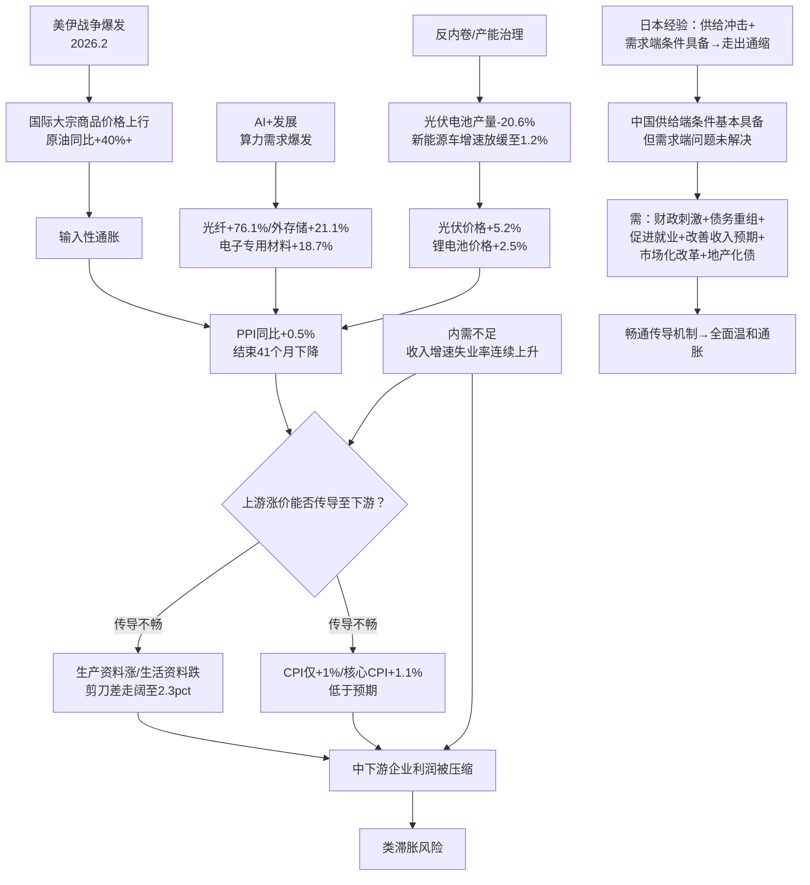

## 研报分析报告

### 核心结论

**作者观点**：PPI提前转正是中国经济走出通缩的积极信号，但涨价高度集中在上游，价格传导机制尚未畅通，内需不足仍是核心制约，需财政、改革、就业等多管齐下才能将供给冲击转化为全面温和通胀。

**我的判断**：文章对PPI转正的结构性解读准确，但整体叙事偏"乐观叙事+审慎结论"的平衡态，实质上给出了一个"不好也不坏、等政策"的骑墙判断。最关键的变量——美伊战争持续时间与油价中枢——被定性为"不确定"，使得所有推论都建立在沙上。真正值得关注的不是PPI转正本身，而是上游涨价对中下游利润的挤压效应，这可能反而加剧经济下行压力。

---

### 1. 取数据（客观事实）

#### 关键宏观数据全量表

| 指标 | 数值 | 口径 | 时间 | 备注 |
|------|------|------|------|------|
| PPI同比 | +0.5% | 同比 | 2026年3月 | 结束连续41个月同比下降 |
| PPI环比 | +1.0% | 环比 | 2026年3月 | 连续6个月上涨，近48个月最高 |
| CPI同比 | +1.0% | 同比 | 2026年3月 | 低于预期 |
| CPI环比 | -0.7% | 环比 | 2026年3月 | 春节后季节性回落 |
| 核心CPI同比 | +1.1% | 同比 | 2026年3月 | 较上月回落0.7个百分点 |
| 剔除黄金饰品核心CPI | ~0.7% | 同比 | 2026年3月 | 变化幅度不大 |
| GDP名义增速 | 4.94% | 同比 | 2026年Q1 | 略低于实际增速 |
| GDP实际增速 | 5.0% | 同比 | 2026年Q1 | — |
| GDP平减指数 | 仍为负 | — | 2026年Q1 | 连续第12个季度为负（文章说11个，需验证） |
| 出口同比 | +14.7% | 同比 | 2026年Q1 | 两位数增长 |
| 基础设施投资同比 | +8.9% | 同比 | 2026年Q1 | 一批重大基建项目开工 |
| 城镇调查失业率（3月） | 5.4% | 月度 | 2026年3月 | 连续3个月上升 |
| Q1城镇调查失业率均值 | 5.3% | 季度均值 | 2026年Q1 | 与上年同期持平 |
| 居民人均可支配收入名义增速 | +4.9% | 同比 | 2026年Q1 | 较2025年全年放缓0.1个百分点 |
| 居民人均可支配收入实际增速 | +4.0% | 同比 | 2026年Q1 | 低于同期GDP增速，较2025年全年放缓1个百分点 |
| 居民消费倾向 | 62.24% | 季度 | 2026年Q1 | 低于上年同期0.83个百分点 |

#### 行业价格数据

| 行业 | PPI同比 | PPI环比 | 时间 | 涨价动因 |
|------|---------|---------|------|----------|
| 光纤制造 | +76.1% | — | 2026年3月 | AI算力需求 |
| 外存储设备及部件 | +21.1% | — | 2026年3月 | AI算力需求 |
| 电子专用材料制造 | +18.7% | — | 2026年3月 | AI算力需求 |
| 生物质燃料加工 | +6.1% | — | 2026年3月 | 绿色转型 |
| 废弃资源综合利用业 | +0.9% | — | 2026年3月 | 绿色转型 |
| 光伏设备及元器件制造 | +5.2% | — | 2026年3月 | 产能治理 |
| 锂离子电池制造 | +2.5% | — | 2026年3月 | 产能治理 |
| 石油和天然气开采业 | +5.2% | +15.8% | 2026年3月 | 输入性（上月同比-12.9%） |
| 有色金属矿采选业 | +36.4% | +5.4% | 2026年3月 | 输入性 |
| PPI生产资料 | 正 | — | 2026年3月 | 涨价主力 |
| PPI生活资料 | 负（同比、环比均降） | — | 2026年3月 | 传导不畅 |

#### 产量数据

| 指标 | 数值 | 时间 | 变化趋势 |
|------|------|------|----------|
| 太阳能电池产量 | 同比-20.6% | 2026年3月 | 2015年有统计以来单月最大降幅，从2025年9月开始持续下降 |
| 新能源汽车产量增速 | +1.2% | 2026年3月 | 略有增长；前2月同比下降，增速自2025年9月放缓 |
| 布伦特原油月均价 | 同比+40%以上，环比+40%以上 | 2026年3月 | 美伊战争驱动 |

#### 机构预测调整

| 机构 | 指标 | 最新预测 | 调整幅度 |
|------|------|----------|----------|
| 野村 | CPI | 0.6% | +0.2个百分点 |
| 野村 | PPI | 1.0% | +2个百分点 |
| 渣打 | CPI/PPI | 上调 | 未披露具体数值 |

#### 数据可靠性与需交叉验证点

1. **GDP平减指数连续季度数**：文章称"连续11个季度为负"，但按Q1名义4.94%<实际5.0%计算，Q1仍为负，应为连续12个季度。此处存疑，需验证起算时间点。
2. **核心CPI剔除黄金饰品后约0.7%**：来源为陆挺、缪延亮的估算，非官方数据，需关注黄金饰品权重的合理性。
3. **中金估算石油三大行业影响PPI环比约0.6个百分点**：属于机构估算，方法论未公开，可交叉对比中信、野村的拆分。
4. **中金预计中东冲突带动中国新能源出口提升10.5%、光伏出口提升17.5%**：此为模型推演结果，假设前提（替代效应弹性、海外产能受冲击程度）高度不确定。
5. **PPI生产资料与生活资料同比剪刀差从0.9走阔至2.3个百分点**：此数据反映了传导断裂的程度在加剧，是全文最重要的结构性指标之一。

---

### 2. 看逻辑（推理链条）

#### 作者核心逻辑链还原

#### 逻辑漏洞与未论证点

**漏洞一：因果归因的权重分配不透明**

文章将PPI转正归因为三类因素（国内供需改善、市场秩序优化、国际因素），并引用毛盛勇称"国内因素更具主导"。但文章自身的数据叙事却显示，3月PPI环比+1.0%中仅石油三大行业就贡献了约0.6个百分点（中信估算），即输入性因素贡献了60%的环比涨幅。这与"国内因素更具主导"的官方定性存在张力，文章未对此矛盾做深入分析。

**漏洞二：日本类比的适用性存疑**

文章借缪延亮之口引用日本经验，暗示"供给冲击可成为积极因素"。但中日差异巨大：日本走出通缩时劳动力严重短缺（供给约束），中国当前面临的是就业偏弱（需求不足）；日本"失去的30年"完成了缓慢去产能去杠杆，中国地产下行周期尚未结束，居民和地方政府资产负债表仍在修复中。类比的前提条件并不对等，文章对此差异提及但未充分论证其影响。

**漏洞三：忽视了上游涨价可能产生的反噬效应**

文章虽然提到"类滞胀风险"，但叙事重心仍放在"如何将供给冲击转化为积极通胀冲击"上。一个被低估的逻辑可能是：上游涨价→中下游利润压缩→裁员/降薪→内需进一步走弱→CPI下行压力加大→GDP平减指数更难转正。这是一个负反馈循环，而非文章暗示的"差一步就能打通"的正反馈。

**漏洞四：对"反内卷"效果的评估过于乐观**

光伏电池产量-20.6%被作为产能治理成效的正面证据，但产量下降是否真的反映了供需关系改善，还是仅仅是行政限产的结果？行政限产下的价格上涨与需求拉动下的价格上涨，性质完全不同。前者不可持续（一旦限产放松价格即回落），后者才是真正的通胀修复。文章未做区分。

**漏洞五：数据选择性地呈现了乐观面**

文章提到PPI环比连续6个月上涨，但未给出此前6个月的具体环比数据，无法判断上涨是加速还是减速。文章提到核心CPI"持续稳定在1%以上"，但剔除黄金后仅0.7%，这个"稳定"的成色不足。文章提到出口+14.7%，但未讨论美伊战争对全球贸易的负面溢出效应（尽管页面侧边新闻提到了"伊朗战争扼杀全球贸易"）。

---

### 3. 查动机（立场分析）

#### 作者/机构立场

- **财新周刊**：定位为市场化财经媒体，长期关注中国经济结构性问题， editorial立场偏向市场化改革和需求侧刺激。本文的叙事方向——"供给端条件已具备，需求端问题未解决"——与财新一贯的"呼唤改革与政策发力"立场一致。
- **引用的机构**：中金公司（缪延亮）、野村（陆挺）、粤开（罗志恒）、国盛（熊园）、中诚信国际（袁海霞）、北大国发院（黄益平）。均为偏学术/研究型机构，非纯卖方，相对而言利益冲突较小。但中金同时有投行业务，其乐观倾向需适度打折。
- **国家统计局（毛盛勇）**：官方立场，倾向于将PPI转正归因为国内因素主导，降低"输入性通胀"对政策制定者的压力暗示。

#### 潜在利益冲突

- 缪延亮来自中金公司，其"将负面供给冲击转化为积极通胀冲击"的论调，对风险资产（股票）是利好叙事，与券商普遍的乐观倾向一致。
- 野村上调CPI/PPI预测，若其客户持有通胀受益资产（如大宗商品、上游股票），则预测上调具有利益一致性。

#### 时间节点与市场情绪

- 文章发表于2026年4月18日，距美伊战争爆发约50天。此时市场对战争影响的定价尚未完成，不确定性极高。在这个时点做"走出通缩"的判断，本质上是在一个高度不确定的外生变量上构建叙事。
- 4月是宏观数据密集发布期（Q1 GDP、3月PPI/CPI），文章选择在此节点推出，有"解读最新数据"的时效性动机。

#### 措辞分析

- **"中国开始走出价格下降通道？"**——标题用问号，既吸引眼球又留有余地，典型的媒体平衡手法。
- **"供给端条件已基本具备"**——"基本"是模糊表述，可进可退。
- **"有望部分缓解"**——"有望"和"部分"双重弱化，降低了中金预测的可验证性。
- **"关键在于"**——文章多次使用，但"关键"从"上游涨价能否传导"→"内需复苏"→"就业"→"服务业管制"不断转移，实际上没有锁定单一关键变量。

---

### 4. 综合判断

#### 可采纳部分

1. **PPI转正的结构性特征**：上游强、下游弱，生产资料涨、生活资料跌，这个判断有坚实数据支撑，可信度高。
2. **传导不畅是当前核心矛盾**：PPI-CPI剪刀差走阔、核心CPI剔除黄金后仅0.7%，数据一致指向传导断裂。
3. **居民收入增速低于GDP增速、消费倾向下降**：这是内需不足的硬证据，不是观点而是事实。
4. **中东冲突与国内"反内卷"在新能源领域形成共振**：这是一个有洞察的分析框架，逻辑自洽。

#### 需验证部分

1. **PPI转正中"国内因素主导"vs"输入性因素贡献60%环比涨幅"**——需要更细的行业拆分数据，尤其是扣除石油和有色后的PPI环比走势。
2. **中金关于新能源出口提升10.5%的估算**——假设前提需验证：海外竞争对手的油气依赖度、替代弹性、中国新能源产品的价格弹性。
3. **PPI环比连续6个月上涨的趋势是否加速**——需查看2025年10月至2026年2月的环比数据。
4. **"反内卷"限产能否持续**——光伏电池产量-20.6%是否伴随产能退出（而不仅仅是暂时减产），需要产能利用率数据。

#### 存疑部分

1. **"日本经验可借鉴"的类比**——中日经济结构、人口趋势、政策空间差异巨大，类比的解释力有限。
2. **"抓住机会将负面供给冲击转化为积极通胀冲击"**——这个论断的前提是"通胀总是好的"，但对于中国当前需求不足的环境，成本推动型通胀可能适得其反。
3. **文章对房地产化债的讨论过于简略**——仅提到陆挺的观点，未展开讨论。房地产下行对居民资产负债表和消费的影响是"需求不足"的根本原因之一，文章在此处的分析深度不足。

#### 我的独立判断

**当前中国面临的核心问题不是"通胀不够"，而是"收入不够"。** PPI转正如果是成本推动型，而非需求拉动型，那么它改善的是上游企业的利润（且主要是国企），同时侵蚀中下游企业的利润（且主要是民企和中小企业）。在居民收入增速低于GDP增速、消费倾向下降的背景下，上游涨价不仅不会传导至下游，反而可能形成"类滞胀"格局——即PPI上涨、CPI低迷、企业利润分化、就业承压。

**真正的分水岭不是PPI是否转正，而是居民收入增速能否超过GDP增速。** 在此之前，任何"走出通缩"的判断都是 premature 的。

**从投资角度看**：
- 上游资源品（有色、能源）短期有交易性机会，但高度依赖战争进展，不确定性极大；
- 中下游制造业面临"原材料涨价+终端难提价"的利润挤压，盈利预期应下调而非上调；
- 消费板块在收入预期未改善前，不应因"CPI回升"而加仓——因为CPI回升的驱动力是成本而非需求。

---

### 后续跟踪

| 跟踪指标 | 验证目的 | 时间节点 | 数据来源 |
|----------|----------|----------|----------|
| PPI环比（扣除石油有色后） | 判断国内因素贡献是否在上升 | 每月中旬 | 国家统计局 |
| PPI生产资料-生活资料剪刀差 | 传导是否在改善 | 每月中旬 | 国家统计局 |
| 核心CPI（剔除黄金） | 终端需求是否真正回暖 | 每月中旬 | 国家统计局/野村估算 |
| 居民可支配收入实际增速 vs GDP增速 | 收入分配是否改善 | 季度 | 国家统计局 |
| 城镇调查失业率 | 就业市场是否回暖 | 每月中旬 | 国家统计局 |
| 布伦特原油价格中枢 | 战争因素是否消退 | 持续 | ICE |
| 光伏/新能源车产能利用率 | "反内卷"是真去产能还是假减产 | 季度 | CPIA/CAAM |
| 霍尔木兹海峡通行状态 | 战争最核心的外生变量 | 持续 | 航运数据 |
| 房地产销售面积与价格 | 居民资产负债表修复进度 | 每月中旬 | 国家统计局/中指院 |

**关键触发条件**：
- **看多信号**：核心CPI（剔除黄金）连续3个月>1.0% + 居民收入实际增速>GDP增速 + PPI生活资料环比转正
- **看空信号**：PPI继续上行但CPI持续<1% + 中下游企业利润增速显著下滑 + 失业率突破5.5%

*内容由 AI 生成仅供参考*