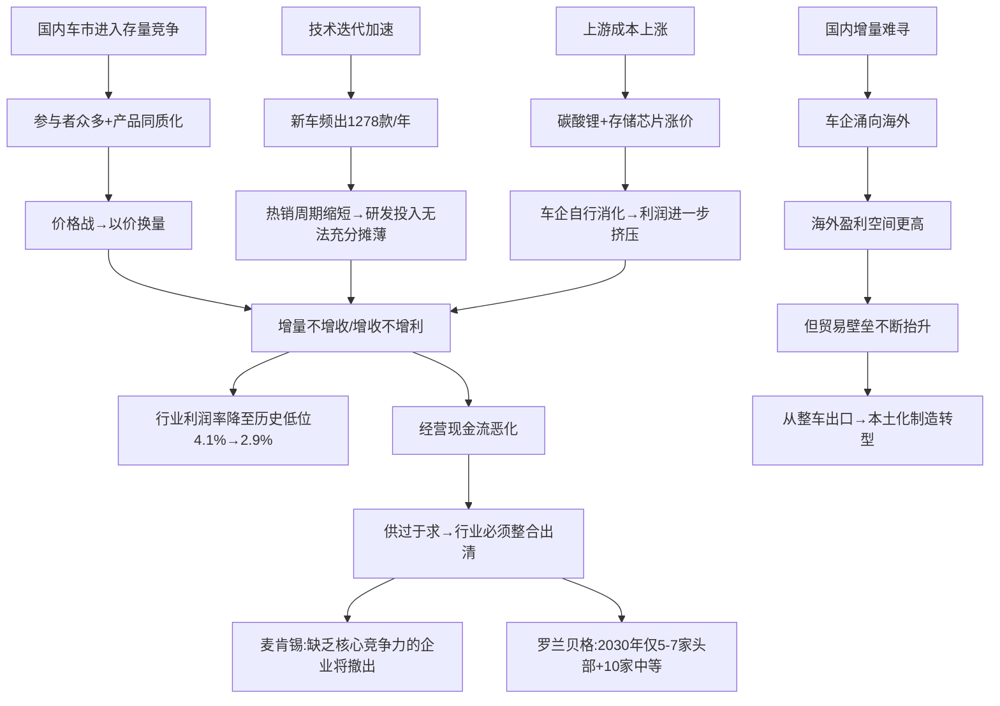

## 研报分析报告

### 核心结论

**文章观点**：中国车市已进入存量竞争阶段，供过于求、价格内卷、盈利能力系统性下滑，唯有行业整合出清才能实现新平衡；海外市场是短期关键增量，但贸易壁垒正在抬升。**我的判断**：文章对行业困局的描述基本准确，数据和案例扎实，但在"出清时间表"上过于乐观——低利率环境下尾部企业出清速度将慢于预期，行业利润率2.9%的极端低位可能在2026年全年持续，而非V型反弹。海外市场的增量逻辑成立，但需警惕地缘风险从"关税壁垒"升级为"供应链脱钩"的尾部风险。

---

### 1. 取数据（客观事实）

#### **宏观与行业数据**

| 指标 | 数值 | 来源 | 备注 |
|------|------|------|------|
| 2026Q1汽车销量 | 704.8万辆，同比-5.6% | 中汽协 | 其中国内482.3万辆，同比-20.3%；出口222.6万辆，同比+56.7% |
| 2025年汽车行业销售利润率 | 4.1%，同比-0.2ppt | 乘联会/崔东树 | 历史最低，低于下游工业企业均值5.9% |
| 2026年1-2月汽车行业利润率 | 2.9% | 文章引用 | 进一步恶化，1-2月为传统淡季需季节性调整 |
| 2025年汽车行业总收入 | 111,796亿元，同比+7.1% | 乘联会 | 增收不增利典型 |
| 2025年汽车行业利润 | 4,610亿元，同比+0.6% | 乘联会 | 利润增速远低于收入增速 |
| 2025年国内汽车产能利用率 | 73.2% | 国家统计局 | 多家车企低于此线 |
| 2025年国内上市新车 | 1,278款，日均3.5款 | 易车数据 | 含近200款全新车型 |
| 2025年中国汽车出口量 | 约800万辆（全年） | 多方估算 | 连续三年全球第一 |

**需交叉验证的点**：文章称"一季度国内汽车销量同比下跌逾两成"，与中汽协数据"国内销量482.3万辆，同比下降20.3%"吻合，口径一致。但需注意"汽车销量"包含乘用车+商用车，若只看乘用车终端销量，Q1同比下降16.9%（口径不同），文章引用的"两成"数据更接近批发口径。

#### **重点车企2025年财务数据**

| 车企 | 营收（亿元） | 营收增速 | 归母净利润（亿元） | 利润增速 | 经营现金流 | 备注 |
|------|------------|---------|------------------|---------|-----------|------|
| 比亚迪 | 8,039.65 | +3.46% | 326.19 | -18.97% | 591.35亿，-55.69% | 研发投入634亿，+17% |
| 上汽集团 | 6,564.6（整车4,101.9） | 整车+12.3% | 101.06 | +500%+ | 下滑>50% | 2024年低基数（计提78.74亿减值） |
| 广汽集团 | 956.62 | -10.43% | -87.84 | 首次全年亏损 | 由正转负 | 单车毛亏0.83万元 |
| 长安汽车 | 1,640 | +2.6% | 40.75 | -44.3% | 下滑>50% | — |
| 吉利汽车 | — | — | 168.5 | 基本持平 | 正增长 | 经营现金流正向 |
| 长城汽车 | — | — | — | — | 正增长 | 经营现金流正向 |
| 理想汽车 | — | — | 11.4（净利） | GAAP经营亏损5.2亿 | — | 依赖19.2亿利息/投资收益 |
| 零跑汽车 | — | — | 5.4 | 首次全年盈利 | — | 交付59.6万辆，新势力第一 |
| 小鹏Q4 | — | — | Q4净利3.8亿 | GAAP经营亏损0.4亿 | — | 8.4亿政府补贴贡献大 |
| 蔚来Q4 | — | — | Q4净利2.8亿 | GAAP经营利润8.1亿 | — | Q4销量12.4万辆创新高 |
| 小米汽车 | 千亿级（含AI） | — | 经营收益9亿 | — | — | 毛利率24.3%，交付41.1万辆 |
| 宁德时代 | — | — | 722 | — | — | 超13家A股上市车企利润总和 |

#### **海外业务数据**

| 车企 | 2025海外营收（亿元） | 海外营收占比 | 海外毛利率 | 国内毛利率 | 出口量 |
|------|---------------------|------------|-----------|-----------|--------|
| 奇瑞 | 1,574.2（+56%） | 52%（+14.7ppt） | — | — | 129.4万辆（+33.2%） |
| 比亚迪 | 3,107.41（+40.05%） | 38.65%（+10ppt） | 19.46% | 16.66% | 105万辆（+145%） |
| 上汽集团 | — | — | 12.88% | 10.82% | 百万辆级 |
| 广汽集团 | — | — | 6.03% | -4.69%（毛亏） | 约10万辆级 |

#### **产能利用率（广汽集团2025）**

| 工厂/品牌 | 产能利用率 | vs行业均值73.2% |
|-----------|-----------|----------------|
| 广汽丰田 | 76% | 高于 |
| 广汽本田 | 59% | 低于14.2ppt |
| 广汽埃安 | 54% | 低于19.2ppt |
| 广汽传祺 | 46% | 低于27.2ppt |

#### **比亚迪负债结构变化**

| 指标 | 2024年末 | 2025年末 | 变化 |
|------|---------|---------|------|
| 应付票据+应付账款+其他应付款 | — | 3,287亿元 | — |
| 无息负债占总负债比重 | ~66.6% | 52.57% | 下降约14ppt |
| 资产负债率 | 74.64% | 70.74% | 下降3.9ppt |

**数据可靠性评估**：核心数据均来自中汽协、乘联会、国家统计局等官方渠道及上市公司财报，可信度较高。文章引用崔东树测算的行业利润率与乘联会公开数据一致，经交叉验证无矛盾。

---

### 2. 看逻辑（推理链条）

#### **文章核心逻辑链**

#### **逻辑漏洞与未论证点**

**漏洞1：出清机制的假设过于简单**

文章引用麦肯锡和罗兰贝格的判断，认为缺乏竞争力的企业将"逐步撤出"，到2030年行业集中度大幅提升。但这个逻辑链跳过了一个关键环节——**谁在为这些弱势企业续命？** 中国车市的特殊性在于：地方政府（国有车企）、产业资本（华为系、小米等科技巨头）、甚至地方金融机构都有动机阻止车企倒闭。广汽集团亏损87.84亿仍在"战时状态"推进变革，背后是广州市政府的底线支撑。**尾部企业出清的速度可能远慢于咨询公司的预测**，这意味着行业低利润率的持续时间可能超预期。

**漏洞2：海外增量=利润增量的等式不稳固**

文章展示了海外毛利率普遍高于国内的数据，暗示海外是利润解药。但这里存在几个被跳过的问题：第一，海外毛利率高部分是因为早期以批发价出口（未含终端营销、售后体系建设成本），随着本土化深入，毛利率可能收窄；第二，贸易壁垒（欧盟反补贴关税、美国100%关税）直接影响的是增速而非利润率，但文章将两者混为一谈；第三，海外建厂意味着资本开支大幅增加，短期内反而可能拖累现金流。

**漏洞3："新车效应死亡谷"的逻辑需要定量验证**

李斌提出的"产能爬坡完成后需求已下滑"的"死亡谷"模型是一个有洞见的定性判断，但文章未提供任何定量数据来支撑。例如：典型车型的热销周期到底从多久缩短到了多久？产能爬坡到满产通常需要几个月？需求衰减曲线是什么样的？这些数据的缺失使得"死亡谷"概念更像是一个直觉性判断而非可验证的模型。

**遗漏的重要变量**

- **政策变量**：购置税政策退坡对2026Q1销量下滑的影响有多大？文章提到但没有展开分析。如果政策是主因，则Q1可能是周期性底部而非趋势性下滑。
- **混动/燃油车的结构性变化**：2026Q1终端数据显示，只有HEV（油电混动）同比增长+2.7%，纯油车-12.8%、纯电-19.6%、插混-31.9%。这个结构性信号非常重要——消费者可能在新能源和燃油车之间犹豫，转向混动作为过渡方案。文章完全忽略了这一趋势。
- **利率环境与融资约束**：在当前低利率环境下，弱势车企的融资成本下降，可能延缓出清节奏。

---

### 3. 查动机（立场分析）

#### **作者/机构立场**

财新周刊作为财经媒体，整体立场偏客观中性，但有几层微妙倾向：

- **叙事倾向**：文章标题"车市苦战"和副标题"市场整合出清才能实现新平衡"，已经预设了"行业困境→整合出清→新平衡"的线性叙事框架。这种框架倾向于放大困境数据、弱化结构性亮点。
- **信源选择**：大量引用车企高管（魏建军、李斌、卢放）和管理咨询公司（麦肯锡、罗兰贝格）观点，但缺乏卖方分析师或买方投资者的视角。车企高管天然倾向于夸大行业困境（为自身业绩不佳找外部原因），咨询公司天然倾向于预测行业整合（为其并购咨询业务铺路）。
- **时间节点**：文章发表于2026年4月18日，恰逢年报季结束、Q1数据刚刚出炉，是市场情绪最悲观的时点。选择此时发布"苦战"主题文章，有迎合市场情绪的嫌疑。

#### **潜在利益冲突**

- 部分被引用车企是财新广告客户或订阅客户
- 咨询公司观点的引用可能存在"互惠"关系
- 文章末尾"页面加载中...订阅后继续阅读"的提示，暗示完整内容需要付费，免费版可能有选择性地呈现更悲观的内容以刺激订阅

#### **措辞分析**

- "苦战"——情绪化用词，强化困境叙事
- "厮杀"——军事化隐喻，暗示行业竞争的非理性
- "死亡谷"——李斌引语，但文章将其作为框架性概念使用，放大了冲击力
- "大概率事件"（卢放：汽车涨价是大概率事件）——将个别高管的主观判断包装为高置信度预测，缺乏数据支撑

---

### 4. 综合判断

#### **可采纳部分**

1. **行业利润率系统性下滑**是硬数据支撑的事实，4.1%→2.9%的趋势无需质疑。2026年全年行业利润率大概率在3%-4%区间，除非出现大规模减产或终端提价。
2. **"增量不增收、增收不增利"的行业痛点**在比亚迪、广汽、长安等案例中反复验证，这是价格战的直接结果，逻辑链条完整。
3. **海外市场的增量逻辑**成立，2026Q1出口占比超30%是里程碑式数据。比亚迪海外毛利率高于国内近3个百分点也是可验证的事实。
4. **现金流恶化**是比利润下滑更值得警惕的信号。比亚迪经营现金流-55.69%、广汽由正转负，说明问题不仅仅是利润表层面，而是企业的"氧气"在减少。
5. **宁德时代722亿净利润超13家A股车企之和**——这个数据点极具冲击力，揭示了产业链利润向上游集中的结构性趋势。

#### **需验证部分**

1. **行业出清的时间表**：罗兰贝格预测2030年剩5-7家头部+10家中等，需验证其假设前提——如果地方政府持续输血，出清速度可能慢2-3年。
2. **上游涨价能否传导至终端**：卢放称"汽车涨价是大概率事件"，但当前竞争格局下，谁先涨价谁就丢市场份额。需跟踪2026Q2-Q3是否有车企试探性提价。
3. **新势力盈利的可持续性**：蔚来Q4盈利靠前置费用+集中卖车，小鹏Q4盈利靠政府补贴+大众合作收入，都不是可持续的主业盈利模型。需跟踪2026Q1-Q2这些公司是否再次亏损。
4. **购置税退坡的影响力度**：2026Q1国内销量-20.3%中，有多少归因于政策退坡、多少归因于需求萎缩？这决定了Q2是否会出现反弹。

#### **存疑部分**

1. **"新车效应死亡谷"模型**：概念有启发性但缺乏定量支撑，不能直接用于投资决策。
2. **广汽集团的"战时状态"**：管理层表态无法替代财务数据，87.84亿亏损+产能利用率46%-59%的工厂如何扭亏，文章未给出可操作的路径。
3. **日系车企海外模式可复制性**：文章暗示中国车企应学习日系"政企协作、全链条出海"模式，但中日两国面临的国际政治环境截然不同，日系出海时未遭遇当前级别的地缘对抗，类比需要打折扣。

#### **我的独立判断**

**对行业**：中国汽车行业正处于典型的"囚徒困境"博弈中——每家车企都知道降价不可持续，但没有一家敢先停手。在缺乏外部强制力（如大规模倒闭潮或政策干预）的情况下，这种均衡可能维持比预期更长的时间。行业利润率2.9%不是底部，如果碳酸锂和芯片价格继续上涨、Q2价格战持续，2026年全年利润率可能触及2.5%-3%。

**对投资**：

- **短期（3-6个月）**：行业整体不具备配置价值，利润率触底信号尚未出现。如果Q2出现购置税退坡后的需求反弹+终端提价试探，可能是左侧布局窗口，但需等待确认信号。
- **结构性机会**：宁德时代（产业链利润向上游集中）、比亚迪（海外业务占比提升+毛利率结构性高于国内）是行业困局中的相对受益者。但比亚迪当前估值需警惕研发634亿/年的"永续投入"对利润的长期压制。
- **规避标的**：广汽集团（产能利用率低+毛亏+现金流为负，短期看不到拐点）、理想汽车（增程护城河被攻破，i6定价偏低拖累毛利，Q1-Q2可能再次亏损）。

---

### 后续跟踪

| 关键假设验证点 | 时间节点 | 数据来源 |
|--------------|---------|---------|
| 2026Q2行业利润率是否止跌 | 2026年7月 | 国家统计局月度数据 |
| 是否有车企试探性提价 | 2026年5-6月 | 终端售价监测/乘联会 |
| 蔚来、小鹏Q1是否再次亏损 | 2026年5-6月 | 上市公司季报 |
| 广汽集团重组方案进展 | 2026年H1 | 公司公告/财新跟踪报道 |
| 欧盟《工业加速法案》最终条款 | 2026年下半年 | 欧盟官方公报 |
| 碳酸锂价格走势 | 持续跟踪 | 百川盈孚/SMM |
| 比亚迪2026海外销量目标达成率 | 2026年Q2-Q3 | 月度产销快报 |
| 购置税退坡后的需求反弹力度 | 2026年5-6月 | 中汽协月度数据 |

> 本分析基于财新周刊《车市苦战》（[财新网](https://weekly.caixin.com/2026-04-18/102435444.html)）及相关公开数据，供研究参考，不构成投资建议。

*内容由 AI 生成仅供参考*