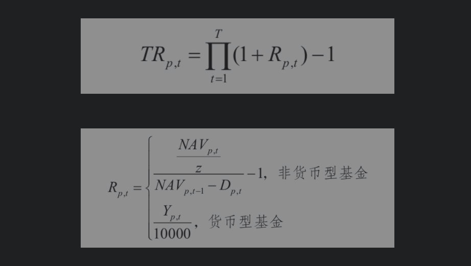

## 3.1资产配置的本质

**资产配置是指依据投资者的投资目标和风险偏好，在各类资产间分配资金的决策。**

资产配置决定了一个投资组合波动的90%甚至更多。

不同的大类资产可视为对不同宏观经济风险因子的暴露的组合。

## 3.2　经典资产配置方法

### 3.2.2　基于经济周期的配置方法：美林时钟模型

对**资产未来表现预测**的方法有两大类。第一类方法较为直观，利用时间序列模型对资产收益率建模，基于拟合好的模型对资产未来表现进行预测。经验研究表明，波动率模型往往表现还不错，但关于收益率的时间序列模型的预测表现，哪怕不是灾难性的，也难言理想。

另一类常用方法是，首先**基于一定规则划分经济周期**，然后统计不同经济周期下每类资产的历史表现（包括绝对收益、收益排序等），再根据最新的数据，**按照规则确定当前所处的经济周期**，得到对未来一段时间各类资产表现的预测。

一个简单明了的做法是，**根据最新的经济增长和通胀数据，确定当前的经济周期，然后配置该周期下历史表现最好的一类资产，之后每个月按最新的数据进行一次再平衡操作。这便是经典的美林时钟模型**。

### 3.2.3　风险导向的配置方法：风险平价模型

由于债券的波动比股票小很多，60/40股债组合超过90%的波动都来自股票，这使得这一经典投资组合在相当程度上失去了分散化投资的意义。

在实践中应用风险平价模型往往都会**利用杠杆**，以将组合的风险水平调整至一个合意的水平，并显著提升组合的预期收益。

风险平价在实践中的可行性依赖于加杠杆的融资成本。

### 3.2.4　目标风险模式

在投资实践中，可以设定多档目标风险水平，以满足不同风险偏好的投资者。例如，一种典型的做法是设定3档目标波动率水平（8%、12%和15%的年化波动率），分别用以满足稳健型、平衡型和激进型投资者。

无论如何，**所有的投资主要都是基于中长期的决策**，不会因为短期的波动而大幅调整，因此其长期表现会比较稳定、可预期。

### 3.2.5　目标日期模式

目标日期模式会在开始投资时确定一个目标到期日，并根据距离该目标到期日的时间，确定投资组合中各类资产的权重。

### 3.2.6　耶鲁模式

大卫·史文森自1985年起执掌耶鲁捐赠基金，在20多年间，实现了接近13%的年化收益和0.55的夏普比率。

耶鲁捐赠基金的投资范围要广泛得多，他们长期坚持在股票、债券、对冲基金、私募股权等传统资产和另类资产，乃至实物资产间做高度的分散化投资，以有效控制组合风险。

其次，耶鲁模式对股权投资有显著的偏好，从其公开披露的资产配置来看，其股权资产配置长期占据着大头。

某种程度上，私募股权投资可以看作是**传统股票投资加上额外的非流动性风险敞口**。而按照加拿大投资管理局的研究，私募股权投资可以近似等价为130%的股票多头加上30%的债券空头的组合。

**耶鲁捐赠基金非常善于挑选优质的私募股权项目，这可能得益于其优秀的校友资源**。

## 3.3　改进的资产配置方法

### 3.3.2　全天候策略

### 3.3.3　下行风险平价

### 3.3.4　泛化的时钟模型

## 3.5　FOF管理中的资产配置

资产配置是起点，也是极为重要的一环。**资产配置获取的是Beta**，以及通过动态再平衡获得的择时Alpha。上述FOF管理全流程，实质上是旨在获取Beta加双重Alpha——资产配置层面的择时Alpha，以及优选基金的Alpha。

资产配置本身是**一项长期**的工作，请务必做好计划，按照原则和规划而行，不可因一时的市场波动而乱了手脚。

挪威主权基金坚持通过指数化投资或**Smart Beta投资**，以低成本获取Beta收益。

## 4.1 基金筛选的本质

基金筛选有着明显的双重目标——**在密切跟踪基准大类资产指数的同时，尽可能获取超额收益**。

FOF不提倡集中投资，它天然就具有分散化的特征。因此**在基金筛选进行之前完成了资产配置就意味着锁定了Beta**。

基金评价有3个切入角度:对单个基金的分析和评价，对基金经理的分析和评价和对对基金公司的分析和评价。

## 4.2 基金评级方法

**基金评价是筛选基金的基础**。

### 4.2.1 晨星的风险调整后收益方法

晨星假定投资人为理性投资者。

基金分类是晨星评价的基石.

晨星的基金分类从投资者的角度出发，主要采取**事后分类**的方法，以基金投资组合为基础进行分类，而不是仅仅按照基金招募说明书的规定和描述进行分类。

自2004年首次提供中国市场基金分类以来，晨星的基金分类方法随着市场发展在细节上时有调整。

风险调整后收益:
通常方法：先通过调整杠杆率使不同基金以波动率等指标衡量的风险水平相等，再对它们进行比较。

晨星方法：在进行基金评级时，只需**奖励收益并惩罚风险**就可以了。

由于晨星评级反映的是**基金的相对表现**，一只基金的晨星星级评价结果变差，并不一定表示其业绩表现的回落，也可能只是其他同类基金表现转好所致。

### 4.2.2　理柏的分维度评分体系

理柏（Lipper）认为，**基金评级应以投资者不同的投资需求为出发点**，帮助不同的投资者根据特定的投资目标更有针对性地进行筛选，从而避免购买不合适的基金。

理柏基金中国评级通过4个独立的评估标准帮助投资者或投资顾问挑选最适合其投资风格和投资目标的基金，总回报、稳定回报、保本能力和费用。

稳定回报的计算基于两项数值：Hurst-Holder指数（简称H指数）和有效回报。H指数用来衡量风险程度，或者说**价格序列曲线的粗糙度**。

保本能力被定义为在考察周期内，**该基金所有月度回报为负的回报总和**。

**理柏不提供综合评分**。

### 4.2.3 国内第三方评价体系综述

海通基金评级指标分为4大类：简单收益、风险调整收益、持股调整收益和契约因素。

简单收益：

对于风险调整收益，海通主要采取了经典的夏普比率、特雷诺比率和信息比率3个指标，分别代表总风险调整收益、系统性风险调整收益和非系统性风险调整收益，以综合评价基金的历史风险与收益。

夏普比率：衡量基金每承担一单位总风险获得的超额收益率。

特雷诺比率：衡量基金每承担一单位系统性风险获得的超额收益率。

信息比率：衡量基金单位跟踪误差带来的超额收益。

**信息比率事实上衡量的便是基金主动管理的夏普比率**。

**当基金收益率的均值低于无风险收益率时，海通会将夏普比率调整为的索提诺比率**。

海通还在风险调整收益的基础上添加了基金持股调整收益作为收益评价的补充。持股调整收益摆脱了传统评价方法仅运用净值表现进行评价的思维定式，首次在国内通过重仓股与传统基金评价方法的互动对基金进行评价。

基金在日常投资中必须遵守基金招募说明书等契约的约定。海通制定了一些指标来衡量基金对契约的遵守情况。

简单收益指标的权重为0.35，风险调整收益指标的权重为0.3，持股调整收益的权重为0.2，契约因素的权重为0.15。在时间加权中，近3年业绩的权重为0.6，近2年业绩的权重为0.2，近1年业绩的权重为0.2。

## 4.3 基金筛选方法

### 4.3.1　基金筛选与基金评价的关系

筛选基金的顶层逻辑一般可分为两步：第一步，对于同资产类别的基金，根据硬性的投资约束及基金历史业绩、风险调整后收益、基金规模和流动性等定量指标，对基金进行初步筛选并确定备选基金；第二步，通过对备选基金的定性及定量分析，再次深度精选基金。

基金评价就是给基金画“像”，这是我们了解投资对象的第一步。在这一步，我们或许不能找出未来表现最为突出的基金，但至少可以**剔除一些综合评分较低、未来表现大概率较差的基金**。

### 4.3.2　基金筛选方法

要衡量一只基金是否能够纳入基金池，除了要考虑收益、基金经理团队专业性等因素之外，还要考虑**基金类别是否与自身的基金风格或投资策略相冲突**。

为了筛选出最符合投资目标的基金标的，对市场基金的分类描述是不可避免的。根据基金的管理方式，我们可将市场基金划分为主动型基金和被动型基金2类。

被动型基金具有非常明晰的特点，不会因为基金经理的更换或者基金经理对市场判断的改变，而**发生所谓的风格漂移等状况，投资者在捕捉特定板块的系统性机会时，往往能够快速且精准**。(反过来可以根据主流 etf 的交易量判断是否机构投资者对风格漂移有预期)。

**投资主动型基金需要有非常强烈的动机**，也就是获取Alpha收益，更准确地讲，是基金经理的优良管理能力带来的Alpha收益。

在实际进行大类资产配置和FOF投资时，**核心-卫星策略**是一个被经常采用的策略。

通过配置费用低廉、流动性较好的被动型基金来构建组合的核心部分并长期持有，在风险可控的前提下，可获取稳健的收益。卫星资产的目标是在核心资产提供的安全垫基础上，通过配置高风险品种来增厚组合的预期收益。因此，其常常更**偏向于配置小盘、另类等波动率较大**的基金。

有效的基金分类基础上，接下来我们进一步讨论不同类型基金的评价与筛选方法。此处我们旨在介绍如何搭建**多因子基金评价体系的框架**，而并非介绍一些具体的评价指标。

首先应该剔除那些仓位变化较大、本身在进行择时的基金产品，原因在于其仓位无法把控。

多因子基金评价是假设某个因子有用，再从数据中挖掘因子有效的证据。

债券型基金筛选：

以资产配置为基础的FOF管理应侧重于纯债基金和一级债基。

**我们有理由认为，在筛选债券型基金时，综合业绩指标的作用不如对股票型基金重要**。

货币型基金筛选：

货币型基金作为流动类资产，**其最重要的目的是满足流动性需求，其次是带来收益**。

### 4.3.3 基金经理评价

我们还可以有效规避以下两种情况：**①选择了一个总体能力并不好的基金经理管理的某一只由于运气好而有较好历史业绩的基金；②没有选择一个能力很强的基金经理管理的一只由于运气差历史业绩不太理想的基金**。

**一个自然的选择是利用基金经理管理的产品的数据，来构建其生涯净值曲线。有了基金经理的生涯净值数据，我们便可以将其视作一只基金产品，计算其各种业绩指标**。

另一种思路是将基金经理评价当作一个过滤条件，即要求基金经理评价得分或其排序不得低于某一门槛，否则便认为该基金经理能力太差，即便其管理的某一产品得到了非常好的评价，也不予以买入。反之，只要基金经理评价得分或其排序超过了这一门槛，便认为该基金经理有较强的管理能力，因此便**不用担忧其管理的产品只是由于较好的运气而获得了不错的业绩**，我们可以聚焦于对基金产品本身的评价。

## 4.4　FOF管理中的基金筛选

一个完整的策略应该包括三部分：中性市场环境下的资产配置、具体的品种选择方法、不同市场环境下的资产调整方式。**策略不光告诉我们该怎么配置资产，还告诉我们在不同市场环境下该如何临时调整资产**。

如果你选择对了细类基金，那么这个细类基金下大部分品种的业绩都差不多。而细类基金之间的长期业绩差距则会拉大。

FOF作为一项商业业务，其核心之一便是专业化分工。

FOF的业务核心之二是策略指导投资。

FOF收益的第二大来源是类别资产配置。

FOF的业务核心之三就是选类别重于选具体品种。

FOF收益的第三来源才是具体品种选择。

## 7.1　风险类型

### 7.2　基金经理的风险

基金经理的风险主要包括管理能力不足和风格漂移两个方面。

如何判断基金经理的投资风格是否发生了漂移呢？与分析基金经理的管理能力类似，可以结合定性和定量的方法来进行分析。

### 7.2.2　尽职调查

首先，获取基金经理及其团队的基本信息，包括基金经理的简介、投研团队信息、过往管理的产品的历史业绩，及所任职基金公司的基本情况等。

## 7.3　产品的风险

### 7.3.1　市场风险

对收益和风险进行细致的分解，分解越细致，理解越深入，管理越容易。

### 7.3.2　流动性风险

**基金管理人应当做好基金中基金的流动性风险管理，对于运用基金中基金财产投资于封闭运作基金、定期开放基金等流通受限基金的，应当合理设置投资比例，制定专门的风险管理制度**。

## 7.4　经营风险

### 7.4.1　合规与操作风险

FOF管理本身是一项系统化的工程，依赖于大量的人员、流程、规章制度以及必要的系统。

这既要求事先搭建相关的管理系统，制定明确、合理、可执行的流程与制度，明确涉及人员、组织架构及各自的权力和责任，又要求相关人员严格遵守制度规范和流程进行管理工作。任何一点不到位，都可能导致经营风险。

### 7.4.2　资金管理

赎回后第3个交易日到账。

